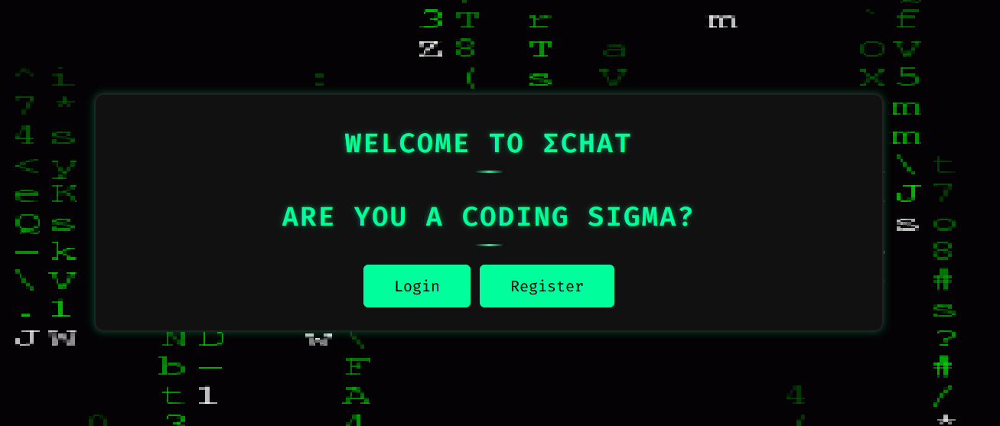
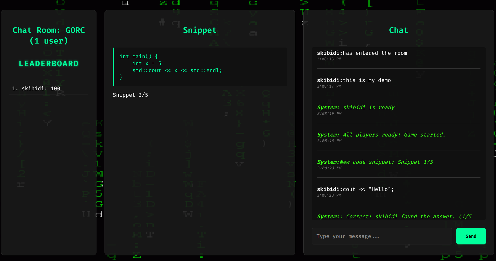

# Chatroom Project - Sigma Chat



This is a *Database System* course final project. The objective is to create a 
chatroom application using contents we learned throughout this course, mainly
focusing in the use of **SQL & NoSQL**.

Our approach led to the output of SigmaChat, a coding competition site in which
you enter a chatroom and compete against other users in correcting lines of codes
with syntax errors in *C++*. It has features such as realtime events handling, leaderboards,
friend list and more.

## 📌 Table of Contents
- [Features](#-features)
- [Demo](#-demo)
- [Installation](#-installation)
- [Project Structure](#-project-structure)
- [Usage](#-usage)
- [Configuration](#-configuration)
- [Tech Stack](#-tech-stack)
- [Contributing](#-contributing)
- [License](#-license)

## ✨ Features
- User authentication system
- Real-time chat functionality
- In-game leaderboard

## 🎥 Demo
| Feature          | Preview                          |
|------------------|----------------------------------|
| Login Screen     |  |
| Chat Interface   |    |
| Leaderboard      |  |

## 🛠️ Installation
1. Clone the repository:
```bash
git clone https://github.com/FerRojasChoco/chatroom_project.git
cd project
```

2. Set up virtual environment:
```bash
python -m venv venv
source venv/bin/activate  # Linux/Mac
.\venv\Scripts\activate   # Windows
```

3. Install dependencies:
```bash
pip install -r requirements.txt
```

4. Run the application:
```bash
python run.py
```

## 📂 Project Structure
```
├── app/
│   ├── auth/
│   ├── chat/
│   └── main/
├── static/
│   ├── css/
│   └── images/
├── templates/
│   ├── auth/
│   ├── chat/
│   └── main/
├── code.csv
└── run.py
```

## 🚀 Usage
Start the application and access these endpoints:
- `/login` - User authentication
- `/chat` - Real-time chat
- `/leaderboard` - Game statistics

Example code:
```python
from app.main import create_app
app = create_app()
```

## 💾 Database Setup

This project uses a **MariaDB** or **MySQL** database. Follow these steps to set up the required database and user before running the application.

This project also uses **MongoDB** and it should be installed beforehand.

#### Prerequisites
Ensure you have a running **MariaDB** or **MySQL** server accessible on `localhost`.

#### 1. Configure Environment Variables (`.env` file)
Create a file named **`.env`** in the project's root directory. This file holds your sensitive configuration values for the application. **You must add `.env` to your `.gitignore` file.**

The values for `DB_USER` and `DB_PASSWORD` **must** match the credentials you create in the next step.

```bash
# .env file content
SECRET_KEY="holaXD"
DB_HOST="localhost"
DB_USER="chatroom_user"
DB_PASSWORD="choco"


## Run this command from your project's root directory:
sudo mariadb -u root -p < db_setup.sql

## ⚙️ Configuration
Edit `app/main/config.py`:
```python
SECRET_KEY = 'holaXD'
DATABASE_URI = 'mongodb://localhost:27017/'
```

## 🔧 Tech Stack
- Python 3.x
- Flask
- MongoDB
- Socket.IO
- HTML/CSS

## 🤝 Contributing
1. Fork the project
2. Create your feature branch
3. Commit your changes
4. Push to the branch
5. Open a pull request

## 📜 License
[MIT](LICENSE)
